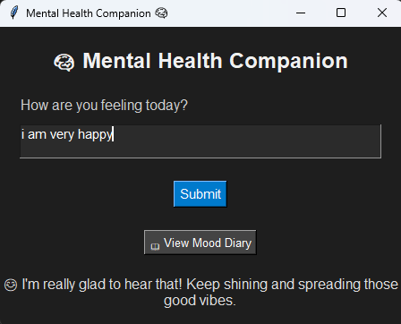

# 🧠 Mental Health Companion (Offline)

This is an AI-powered offline desktop app built with Python and Tkinter to support users' emotional well-being.

## 💡 Features

- 🧾 Detects sentiment from user text input using TextBlob
- 📓 Logs emotional entries daily to a mood diary (`mood_diary.csv`)
- 🎨 Modern dark mode UI with emojis
- 📖 One-click button to view diary
- 💻 100% offline — no internet or account required

## 🛠️ Built With

- Python 3.x
- Tkinter (GUI)
- TextBlob (AI/NLP)
- CSV for diary logging

## 🧠 Screenshot



## 🎬 How to Run

1. Install dependencies:
   ```bash
   pip install textblob
   python -m textblob.download_corpora
